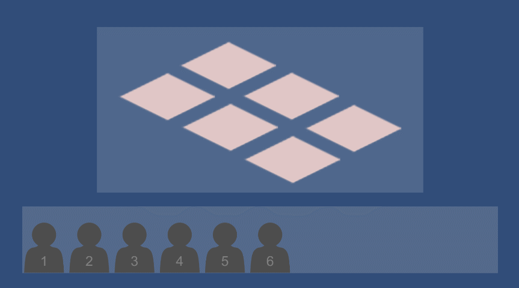

基于UGUI的拖拽组件系统，主要支持以下功能：

1. **Item**的自由拖拽及与**Target**的附着；
2. **Item**和**Target**响应Enter、Exit、Attach、Detach等事件，并通过代理为其添加回调；
3. 可配合LuaFramework（tolua）使用，用于添加Lua回调；
4. 使用`matchingChannel`来限制只有特定通道的**Item**和**Target**可以匹配，并支持万能匹配`universalMatching`；
5. 使用`matchingTag`来识别不同的目标类别；
6. 支持点击或长按**Item**使其从**Target**脱离；
7. 除拖放之外，**Item**还支持响应点击事件，并兼容`ScrollRect`的拖动事件；
8. 可配置**Target**最大可附着的**Item**数量，以及当超出数量时是否替换掉最早附着的**Item**

用法详见工程中附带的示例，场景`Scene`及脚本`TestScript`。

---

A Drag&Drop components system based on UGUI that has the following features:

1. Drag **Item**s freely and attach them to **Target**s;
2. **Item**s and **Target**s can receive callback events like Enter, Exit, Attach, Detach etc;
3. Easy to add Lua callbacks if working with LuaFramework(tolua);
4. Use `matchingChannel` to make sure that only **Item**s and **Target**s with exact channels can match, and alse an extra `universalMatching` property is provided;
5. Use `matchingTag` to identify different **Item** or **Target** types;
6. Detach with long press is supported;
7. **Item**s can also receive click events and are able to work with drag events of a `ScrollRect` as well;
8. The max count of **Item**s one **Target** can be attached to is configurable, and so is the behaviour when more **Item**s are attached(replace the first attached or not)

For more details please run `Scene` or view `TestScript`.

